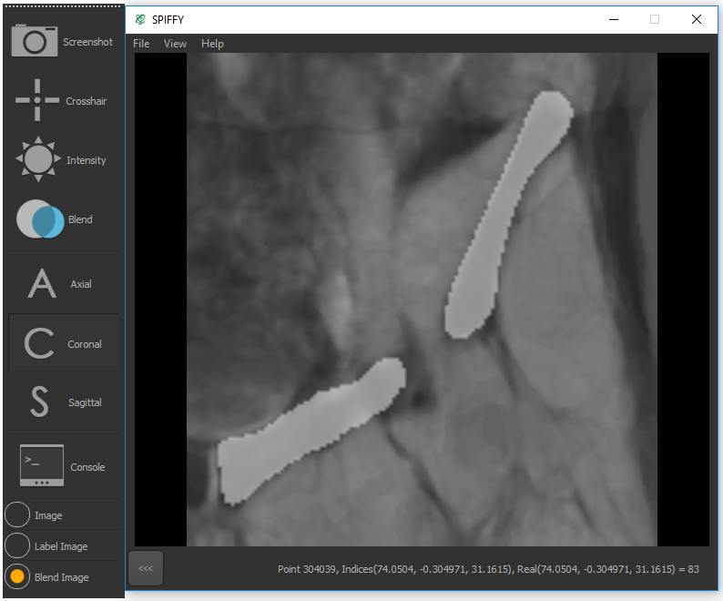



SPIFFY: A Simpler Image Viewer for Medical Imaging

##About
-----
SPIFFY is a C++ based and open-source software which focuses on medical imaging visualization. 
It is a master thesis project undertaked by Jiayu as a student @ University of Queensland and it is supervised by Dr.Shekhar Chandra. 
It has been developed with the combination of some powerful software libraries such as ITK, VTK, Qt, and SMILI. 
It offers a quick view of medical images. SPIFFY also offers some essential manipulation on medical 
images such as showing crosshair on the image, changing image intensity, changing slice orientation, 
changing slices to display, blending the medical image with its label image, a dragging/dropping action of medical 
image and its label image. This may provide a huge convenience for users, such as doctors and researchers, to analyze a 
specific part of the human body according to medical images. 
The user interface of SPIFFY is an application of minimalist aesthetics. 

##Copyright
---------

As a student work, UQITEE, Dr. Chandra, and Jiayu holds the copyright of this software. 

Please Contact Jiayu Sun(jiayusun666@gmail.com) if you have questions.